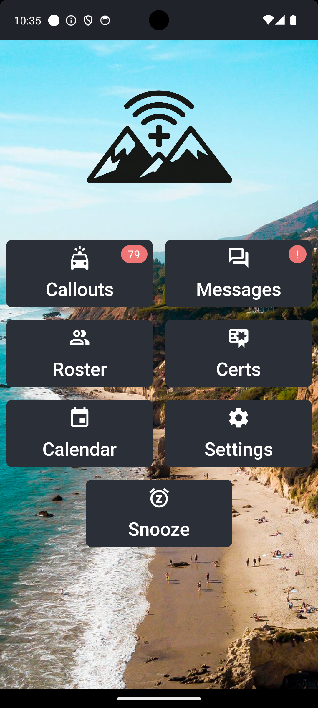
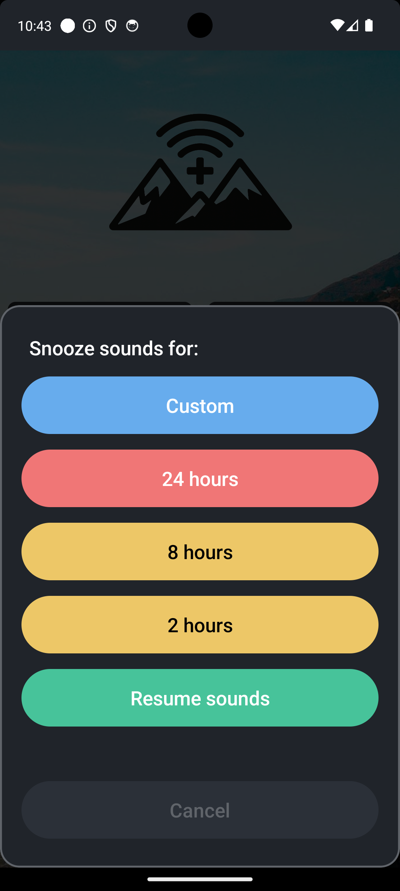

# Home Screen

## Buttons

**Callouts**
:   Show the list of currently active callouts or view the archive.

**Messages**
:   Log of team messages not associated with a callout.

**Roster**
:   List of team members with the ability to see details including phone number, status, etc.

**Certs**
:   Team certification status for each member.

**Calendar**
:   Monthly view showing scheduled events including meetings, trainings, patrols, etc.

**Settings**
:   App settings including notification sounds.

    Also provides some useful debug info and the ability to sign out.

**Snooze**
:   Disable sounds for 2 hours, 8 hours, 24 hours, or a custom duration.

    You will still get the notifications on your phone, but they will be silent. This is useful for a wedding, show, important meeting, etc where you can't be disturbed.

    Press the button again to resume notification sounds.
