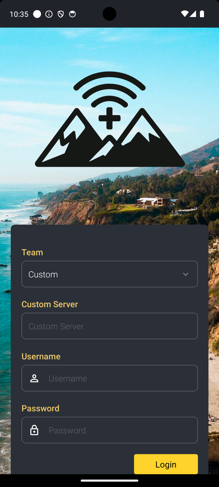

# Login screen
Make sure to accept any permissions dialogs so that all alerts are delivered to your phone.

## Inputs

**Team**
:   Select your team and the app will connect to the appropriate server.

    Select `Custom` to use your own developmeent server.

**Custom server**
:   If you select `Custom` above, put the full URL of the server here. For example: `https://example.com:8000`

**Username**
:   Your short username. For example: `R99`

**Password**
:   Case sensitive password

**Login**
:   Press the button to sign into the server.
